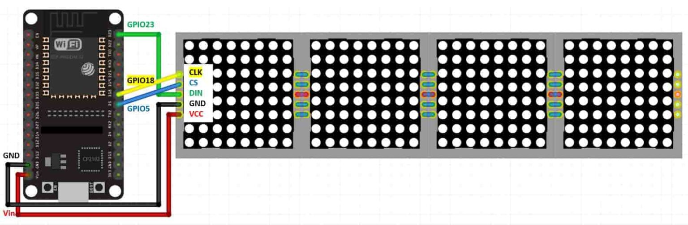

# Git Status Display

This is a display for showing GitHub Collaborations.

## Setup Device

To install the firmware, use platformio and upload the sketch directly to the ESP32.

## Wiring

|ESP32 |DOT MATRIX|
|------|----------|
|5V    |VCC       |
|PIN 18|CLK       |
|PIN 23|DATA      |
|PIN 5 |CS        |
|GND   |GND       |

