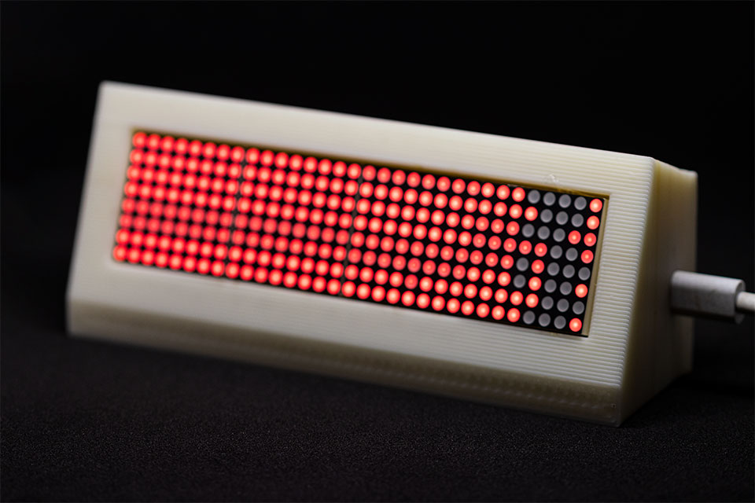

# Git Status Display

This is a display for showing GitHub Collaborations.

## Setup Device

To install the firmware, use platformio and upload the sketch directly to the ESP8266.

Once installed, The device will act as an access point.

To access the access point user the password **0123456789**

browse to **192.168.0.1** and add in your wifi credentials.

Once you have entered the credentials the device will restart and connect to the wifi.

Now find the IP of the device using your prefered IP scanner and access the IP on the website with an address of `/token`
Here you can add your token and display username

## Getting a token

The token can be obtained from github
[Token Generation](https://github.com/settings/tokens)

While generating the token keep in mind that you only need **_read:user_** permission

## Changing username

To change the username you can go to `/username` and update the username

## Reseting the device

To reset the device you can go to `/reset` and this automatically removes the wifi credentials.
For removing the token you'll have to manually go and change the token to blank space

## Wiring

## Enclosure

There are files in enclosure folder that you can modify and slice with your prefered slicer and print.

## Flow Chart

